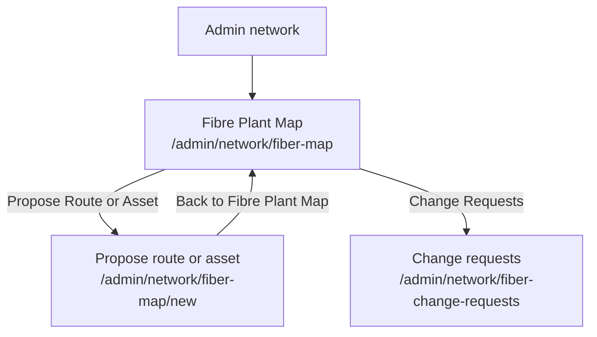

# Fibre Plant Map proposal authoring information architecture

Scope: the Fibre Plant Map and its route/asset proposal workflow. This records
the navigation change introduced by the network-map authoring page; it is not a
whole-product sitemap.

## Sitemap

- **Admin network** - parent navigation area; primary action: open Fibre Plant Map.
- **Fibre Plant Map** (`/admin/network/fiber-map`) - inspect plant and begin a proposal; primary action: **Propose Route or Asset**.
- **Propose route or asset** (`/admin/network/fiber-map/new`) - draw a route or pin a closure for review; primary actions: **Submit route proposal** and **Submit asset proposal**.
- **Change requests** (`/admin/network/fiber-change-requests`) - review pending proposals; primary action: approve or reject a request.

## Navigation model

| Navigation element | Type | What it connects | Always visible? |
| --- | --- | --- | --- |
| Admin sidebar | Global navigation | Admin areas to Network/Fibre | Yes, in admin layout |
| Propose Route or Asset | Contextual button | Fibre Plant Map to map proposal authoring | On Fibre Plant Map |
| Back to Fibre Plant Map | Escape-hatch link | Proposal authoring back to map | On proposal authoring page |
| Change Requests | Contextual button | Fibre Plant Map to approval queue | On Fibre Plant Map |
| Submit buttons | In-page actions | Draft geometry or pin to the review-gated proposal command | When write permission is present |

Primary navigation is the admin sidebar. Secondary navigation is the Fibre Plant
Map action row. Tertiary navigation is the authoring form controls. The back
link is the escape hatch, so users do not need to remember a vendor URL.

## Grouping analysis

| Group | Items | Grouping logic | Potential confusion |
| --- | --- | --- | --- |
| Fibre map actions | Change Requests, Propose Route or Asset, plant creation | All act on the displayed network | Proposal authoring previously appeared under Vendors; that separation made the map action feel misplaced. |
| Proposal authoring | Route drawing, asset pinning, optional project/work-order links | Both create review-gated additions to the plant | The two forms are visually distinct by purpose and colour. |
| Review | Pending change requests and approval decisions | Review occurs after authoring, not on the map | Users may expect submitted geometry to be active immediately; pending-review language addresses this. |

## Label audit

| Label | What it leads to | Clear to new user? | Alternative label |
| --- | --- | --- | --- |
| Propose Route or Asset | The map-based authoring page | Yes | Keep |
| Create admin map proposal | The route and asset authoring workspace | Mostly | Propose route or asset |
| Back to Fibre Plant Map | The operational map | Yes | Keep |
| Change Requests | The review queue | Mostly | Review change requests |

## Action placement

| Action | Where it lives now | Where users would look for it | Mismatch? |
| --- | --- | --- | --- |
| Propose a route | Fibre Plant Map action row, then `/admin/network/fiber-map/new` | On the map containing the route context | No |
| Pin a map asset | Fibre Plant Map authoring page | On the map where the asset belongs | No |
| Approve/reject proposal | Change-request review flow | In a review queue, separate from authoring | No |

## Depth and breadth analysis

The deepest focused path is two clicks from the Network sidebar to authoring:
Network -> Fibre Plant Map -> Propose Route or Asset. The map action row has
three related actions, so it remains scannable. `/admin/network/fiber-map/new`
is now reachable from the object it changes and is no longer an orphaned
vendor-route destination.

## Synthesis

The former vendor-route destination was hard to discover in the network mental
model. Putting authoring below Fibre Plant Map keeps drawing, pinning, and
return navigation alongside the plant context. Review remains deliberately
separate because proposal approval is a different, privileged action.
